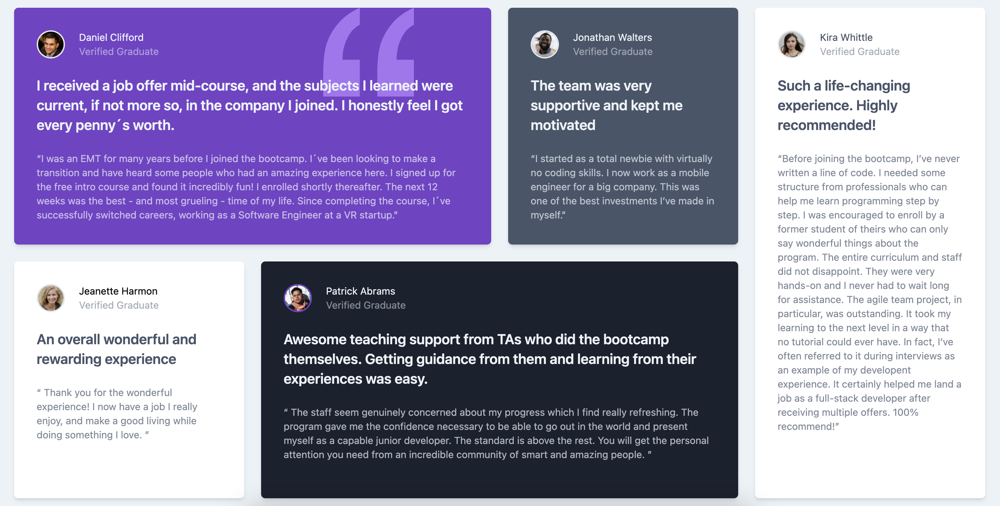
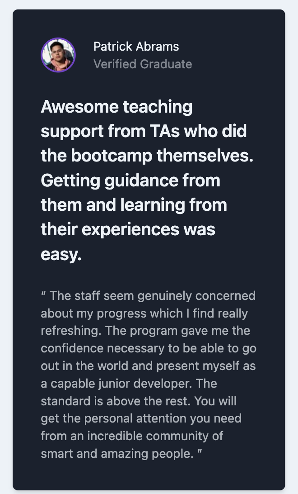

# Frontend Mentor - Testimonials grid section solution

This is a solution to the [Testimonials grid section challenge on Frontend Mentor](https://www.frontendmentor.io/challenges/testimonials-grid-section-Nnw6J7Un7). Frontend Mentor challenges help you improve your coding skills by building realistic projects. 

## Table of contents

- [Overview](#overview)
  - [The challenge](#the-challenge)
  - [Screenshot](#screenshot)
  - [Links](#links)
- [My process](#my-process)
  - [Built with](#built-with)
- [Author](#author)

## Overview

### The challenge

Users should be able to:

- View the optimal layout for the site depending on their device's screen size

### Screenshot

- Desktop View:

 

 
 

- Mobile View

 

### Links

- [Solution URL](https://github.com/Maoaii/Testimonials-Frontend-Mentor)
- [Live Site URL](https://maoaii.github.io/Testimonials-Frontend-Mentor/)

## My process

### Built with

- Semantic HTML5 markup
- [Tailwind](https://tailwindcss.com/) - Tailwind CSS
- Flex
- CSS Grid
- [Google Fonts](https://fonts.google.com/) - For fonts

## Author

- Website - [Lucas Girotto](https://maoaii.github.io/Resume_Website/)
- Frontend Mentor - [@Maoaii](https://www.frontendmentor.io/profile/Maoaii)
